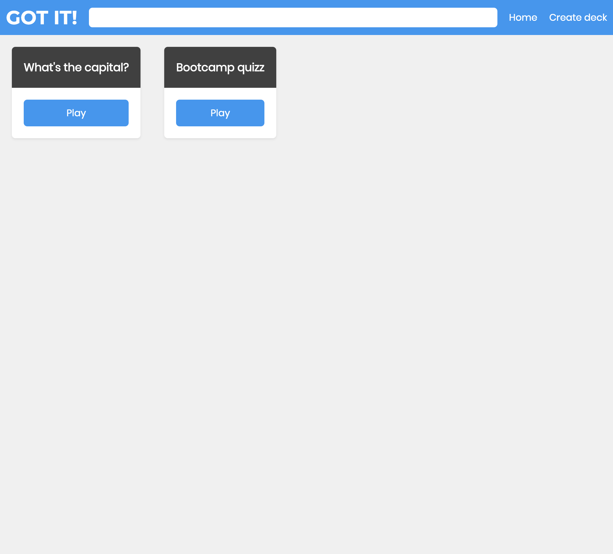

# Instructions

Fork this repository and clone it to start working.

You will need to run `npm install` and `npm start` to run the app.

In additition, you will also need to install the following libraries:  
`redux`  
`react-redux`  
`react-router-dom`  
`styled-components`  
`redux-persist`

# Rubrics

### Core

- React router is used for navigation
- Redux is used for state management
- Allow for the creation of decks with a fixed amount of cards (e.g. 3) and choices (e.g. 4) per answer

### Additional features

- Search feature on the HomePage
- Make it pretty
- Mobile responsive

### Advanced

- Allow for the creation of any number of cards and questions per deck

### Extra

- Use styled components for styling
- Use redux-persist to keep state in localStorage

# Guidelines

## Navbar

The navbar has a logo, a search bar and 2 links on the right of the search bar.  
The logo and the home link both go to the home page (`http://localhost:3000/`).  
The search bar is used to search based on the deck title. It is case insensitive.

## Home

The homepage renders a list of decks (based on the search query) with a link (styled to look like a button) to the deck page (different for each deck).

## Game

The game has a progress bar. It grows each time a question is answered until it is the full width of the card (the card refers to the block element with the black header and buttons).
The progress bar disappears once the game is over.

### Game results

The results card appears once all the questions have been answered.  
It shows a message at the top based on the success rate (percentage of correct answers).
These are the rules you can use for the message:

- if successRate is 0% -> show "Does not get it at all 😞"
- if successRate is inferior to 25% -> show "Potential to get it one day 🤔"
- if successRate is inferior to 50% -> show "Kind of gets it 😐"
- if successRate is inferior to 75% -> show "On the road to getting it 🙂"
- if successRate is inferior to 100% -> show "Almost got it! 😄"
- if successRate is 100% -> show "Got it! 😎"

In addition, the results card shows a list of all the questions with the correct answer and the user's answer in <span style="green">green</span> if the answer was correct, <span style="green">red</span> if the answer was incorrect.

## Create deck

The create deck page allows users to create a deck with a title and any number of cards.  
A card has a question and any number of choices with only one answer.  
You can start by creating a form that only allows users to create a specific number of cards (e.g. 3), each with a specific number of choices (e.g. 4).

A deck starts with at least one card and 2 choices.

Each card can be removed (except the first one). Each choice can be removed (except the 2 first ones).

On form submission, the form is cleared and the newly created deck can be played from the homepage.

# Reference

The logo is using the Montserrat font (the font is already imported in public/index.html).

Redux persist: https://github.com/rt2zz/redux-persist#basic-usage

[Styled-components vscode package](https://marketplace.visualstudio.com/items?itemName=jpoissonnier.vscode-styled-components)

Note about redux and nested objects:  
Remember to not modify the app state directly, make a copy first!  
Example - Trying to remove the first element using splice without modifying the original array:

```js
const elements = [...allElements];
elements.splice(0, 1);
```
